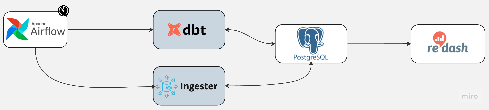
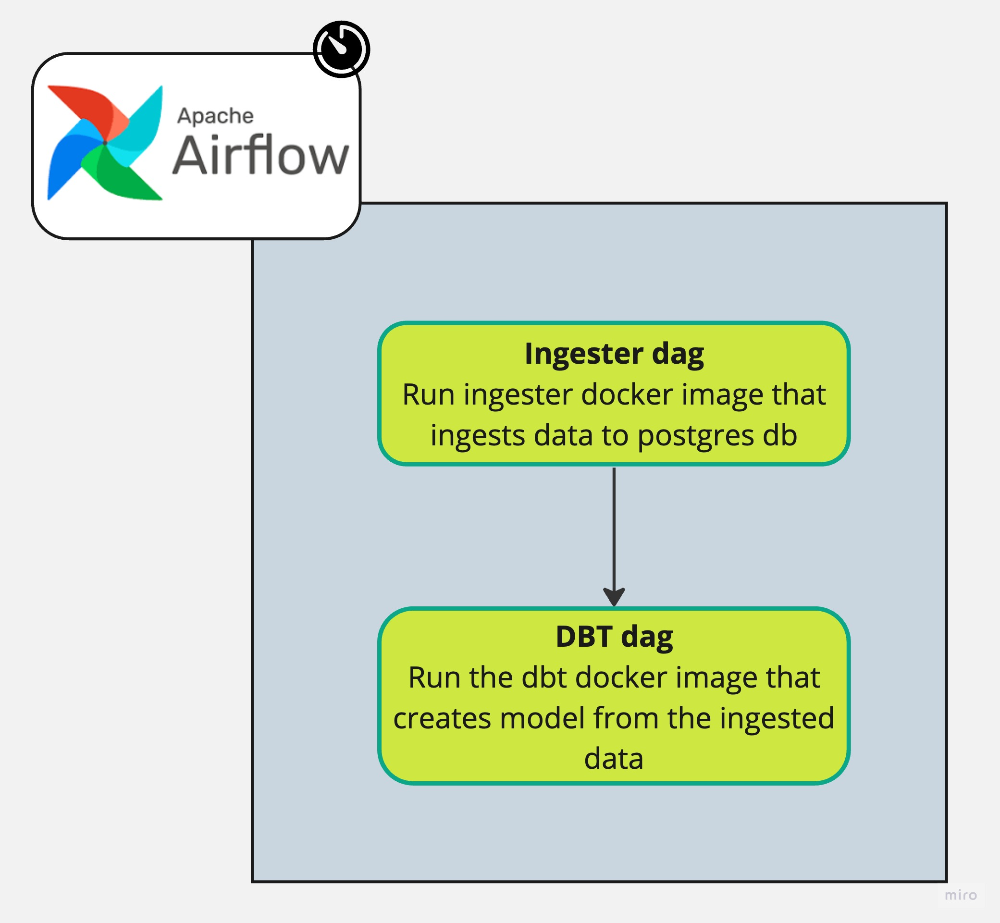

# datawarehouse_with_dbt_redash
A Data warehouse that is built with postgres database that uses airflow to ingest real time data into it. DBT is used as a transformation tool to organize sql queries and redash is used to visualize insights extracted from the data.

## Roadmap
- [x] Get data source
- [x] Write a parser in python
- [x] Ingest data to postgres
- [x] Dockerize postgres database
- [x] Dockerize redash
- [x] Setup DBT
- [x] Create DBT models
- [x] Create visualizations on redash using the models
- [x] Automate the ingestion
- [x] Dockerize airflow
- [x] Dockerize ingesting script
- [x] Dockerize dbt
- [x] Clean up the documentation

## Tech Stack 


| Technology   | Version       | Purpose                               |
|--------------|---------------|---------------------------------------|
|  | 2.7.2        | Workflow automation and scheduling    |
|        | 8.0.0        | Data visualization and dashboards     |
|     | 14          | Relational database                   |
|            | 1.7.1        | Data transformation and modeling      |


## Workflow 


### Airflow container


Airflow runs two tasks, the ingester which is a docker image that takes what is in the ```data/``` folder, parse and ingests it to the postgres database. After that it runs the dbt_model updater which updates dbt models using the ingested data.

## Redash dashboard screenshots


## The data source for this project 
The data taken for this project came from [Neuma](https://open-traffic.epfl.ch/) 
You can read further about the data [here](data/README.md)

## Setup
To run the environment for this project:

- clone this repository:
  
    ```git clone https://github.com/DiboraHaile/datawarehouse_with_dbt_redash.git ```

- Go into datawarehouse_with_dbt_redash directory:

    ``` cd datawarehouse_with_dbt_redash```

- Run the followng on your terminal to start the postgres,redash and airflow containers:

    ``` make setup ```
  
- To stop run:
  
    ``` make stop ```

